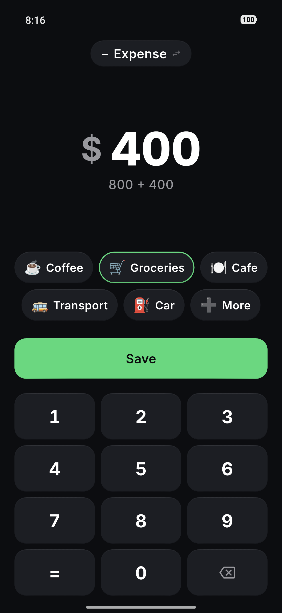
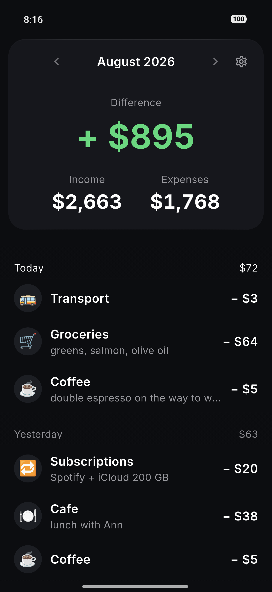

<h1 align="center">QVAS</h1>

<p align="center"><b>An expense goes in before you have put your wallet away.</b><br>
No account, no server, no analytics. Nothing leaves the phone.</p>

<p align="center">
  <a href="https://github.com/yevhenmyronov/qvas/actions/workflows/ci.yml"></a>
  
  
  
</p>

<p align="center"><a href="README.uk.md">🇺🇦 Читати українською</a></p>

<p align="center">
  
  
  
  
</p>

---

## What it is

A two-screen expense tracker for Android, built around one measurable target:
**under two seconds from tapping the icon to a saved transaction.**

That number is the whole design. The pad is already open at launch — there is no
"add" button first. The five categories you use most sit under your thumb.
Amount, category, save. Every other feature was judged by whether it adds a tap
to that path; most do, so most are not here.

- **Two screens.** Entry and history.
- **A calculator on the pad.** Four operations, left to right, no precedence —
  because "two of those and one of these" happens at the till, not in your head.
- **Income**, limited to one job: the difference for the current month. No
  running balance.
- **Where the money went** — categories sorted by amount, not a pie chart.
- Notes, backup and CSV export, Ukrainian and English, undo on delete.

## What it deliberately does not do

| Not here | Why |
|---|---|
| Bank sync, cloud sync | Needs a network, servers and accounts. Destroys the premise in one move |
| Accounts, sign-up, login | No scenario where it helps the user |
| Analytics, telemetry, crash reporting | We accept being blind on purpose |
| Any dependency that touches the network | Checked before it enters `pubspec.yaml` |
| Charts | The question is "where did the money go"; a sorted list answers it faster |
| Currency conversion | We are offline; there is nowhere to get rates from |
| Ads | — |

The release manifest declares one permission: `VIBRATE`. There is no `INTERNET`
permission and no networking dependency, so the app cannot phone home even if
someone added code that tried to.

## Architecture

Flat on purpose — for two screens, layers of abstraction cost more than they
return.

```
lib/
  db/            Drift: tables, DAOs, migrations
  models/        domain models
  repositories/  transactions, categories, settings
  providers/     Riverpod
  services/      backup, CSV, share
  ui/            input · history · sheets · settings · onboarding · common
  theme/         design tokens as Dart constants
  l10n/          ARB files
```

The one rule: the UI never touches Drift directly, only through a repository.

Two decisions that would hurt to change later: **money is `int` in minor units**
(`85.00` is stored as `8500`, because `0.1 + 0.2 != 0.3` and a user who sees the
rows not add up is right to distrust the app), and **dates are stored twice** —
`createdAtUtc` orders records within a day, `localDateKey` decides which day a
record belongs to, and one field cannot do both across a timezone change.

**Stack:** Flutter 3.47 · Riverpod · Drift/SQLite · `minSdk 24` · `targetSdk 36`

## Build

```bash
git clone https://github.com/yevhenmyronov/qvas.git
cd qvas
flutter pub get
flutter run
```

Release builds fall back to the debug key unless you copy
`android/key.properties.example` to `android/key.properties` and fill it in.

## Tests

```bash
flutter test
```

140 tests: money arithmetic, date keys across timezone changes, calculator
semantics, backup round-trips, CSV escaping, and golden tests pinning seven
screen states.

Two of them are lint tests, and they are the ones worth stealing.
`lint_tokens_test.dart` fails the build if a hex colour appears outside
`theme/tokens.dart`, if a radius is written as a number, or if a bottom sheet is
opened anywhere but the one shared helper. `lint_durations_test.dart` requires
every animation duration to go through `AppDurations.of`, which returns zero
when the system "remove animations" setting is on. Each rule exists because the
duplicate it forbids had already happened.

## License

MIT — see [LICENSE](LICENSE). Bundled fonts and dependencies carry their own
licenses, listed in [THIRD_PARTY.md](THIRD_PARTY.md) and shown in the app under
Settings → Licenses.
