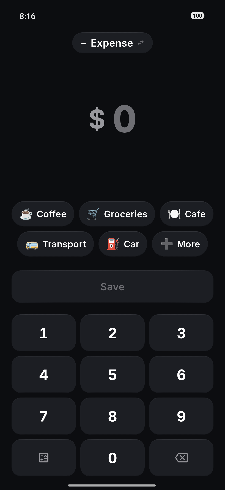
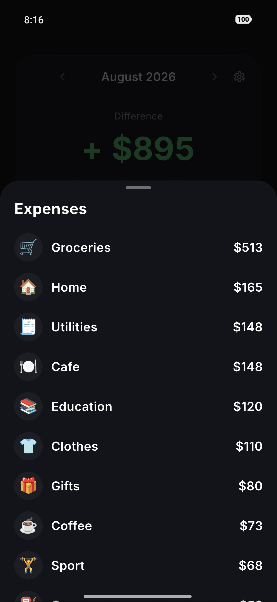

<h1 align="center">QVAS</h1>

<p align="center"><b>An expense goes in before you have put your wallet away.</b><br>
Offline by construction: no account, no server, no analytics, nothing leaves the phone.</p>

<p align="center">
  <a href="https://github.com/yevhenmyronov/qvas/actions/workflows/ci.yml"></a>
  
  
  
</p>

<p align="center"><a href="README.uk.md">🇺🇦 Читати українською</a></p>

<p align="center">
  
  
  
  
</p>

<p align="center"><sub><a href="marketing/screenshots-en/">All ten screenshots</a> · shot from a demo build with seeded data</sub></p>

---

## What it is

A two-screen expense tracker for Android, built around a single measurable
target: **under two seconds from tapping the icon to a saved transaction.**

That number is the whole design. The numeric pad is already open when the app
launches — there is no "add" button to press first. The five categories you use
most sit under your thumb as pinned bubbles. Amount, category, save. Nothing else
is on the path.

Everything else in the product was decided by asking whether it adds a tap to
that path. Most things do, so most things are not here.

## What it does

- **Two screens.** Entry and history. There is no third.
- **A calculator on the pad itself.** `800 + 400` right under the amount, because
  "two of those and one of these" happens at the till, not in your head. Four
  operations, left to right, no precedence — the way a pocket calculator works.
- **Income, deliberately limited.** Income exists to show one thing: the difference
  for the current calendar month. No running balance, no accounts, no carrying a
  remainder forward.
- **Smart categories.** The pinned bubbles reorder by what you actually use — but
  never by time of day, because moving buttons under a thumb destroys the muscle
  memory the two-second target depends on.
- **Where the money went.** A list of categories by amount, not a pie chart. A list
  reads faster and needs no legend.
- **Notes, up to 60 characters.** Enough for "birthday present, Anna", not enough to
  become a diary.
- **Backup and CSV export**, as files, through the system share sheet.
- **Ukrainian and English**, with the currency chosen independently of the language.
- **Undo on delete** — records are soft-deleted, so a mis-tap is recoverable.

## What it deliberately does not do

This list is the product. Each of these looks reasonable on its own, and that is
exactly why they are written down.

| Not here | Why |
|---|---|
| Bank sync | Needs a network, servers and accounts. Destroys the entire premise in one move |
| Cloud sync between devices | Same. Manual export and import instead |
| Accounts, sign-up, login | There is no scenario where it helps the user |
| Ads | — |
| Analytics, telemetry, crash reporting | We accept being blind on purpose |
| Any dependency that touches the network | Every library is checked for network activity *before* it enters `pubspec.yaml` |
| Charts and pie graphs | The question is "where did the money go", and a sorted list answers it faster |
| Multiple wallets or accounts | A direct road to bookkeeping |
| Currency conversion | We are offline; there is nowhere to get rates from |
| Landscape orientation | Doubles the layout work for a use case that does not exist |
| Light theme | Doubles the states to draw and test |

The release manifest declares exactly one permission: `VIBRATE`, for haptics.
There is no `INTERNET` permission and no networking dependency, so the app cannot
phone home even if someone added code that tried to. (Flutter's own debug and
profile manifests do add `INTERNET` — that is the dev tooling talking to the
device, and it is absent from release builds.)

## Architecture

Deliberately flat. For a two-screen app, three layers of abstraction would cost
more in readability than they return.

```
lib/
  db/            Drift: tables, DAOs, migrations
  models/        domain models, enums, extensions
  repositories/  transactions, categories, settings
  providers/     Riverpod providers
  services/      backup, CSV, share
  ui/
    input/       screen 1: pad, calculator, category bubbles
    history/     screen 2: feed, month totals, breakdown
    sheets/      every bottom sheet
    settings/    settings
    onboarding/  first run
    common/      shared widgets
  theme/         design tokens as Dart constants
  l10n/          ARB files
```

The one rule: **the UI never touches Drift directly**, only through a repository.
That single abstraction exists so a future native home-screen widget can read the
same data without being threaded through widget code.

Three decisions worth calling out, because they are the ones that would be painful
to change later:

- **SQLite via Drift, not Hive or Isar.** Not for speed — at ten records a day any
  of them is instant. The reasons are maintenance (both NoSQL options lost their
  maintainers), aggregation (`SUM` and `GROUP BY` run inside the database instead
  of loading everything into memory), and a planned native widget that has to read
  the data from Kotlin.
- **Money is `int` in minor units.** `85.00` is stored as `8500`. `0.1 + 0.2 != 0.3`
  in binary floating point, and a user who notices that the rows do not add up to
  the total is right to distrust the app.
- **Dates are stored twice.** `createdAtUtc` orders records within a day;
  `localDateKey` (`2026-08-13`, computed at write time) decides which day a record
  belongs to. One field cannot do both jobs across a timezone change.

**Stack:** Flutter 3.47 · Dart 3.13 · Riverpod · Drift/SQLite · `minSdk 24` · `targetSdk 36`

## Build

```bash
git clone https://github.com/yevhenmyronov/qvas.git
cd qvas
flutter pub get
flutter run
```

A release build needs a signing key. Copy `android/key.properties.example` to
`android/key.properties` and fill it in — without it the build falls back to the
debug key rather than failing, so this works out of the box:

```bash
flutter build apk --release --target-platform android-arm64
```

For reference, on the development device: cold start **317–364 ms** against an
800 ms budget, arm64 APK **21 MB**.

## Tests

```bash
flutter test
```

140 tests across 23 files: money arithmetic and rounding, date-key behaviour across
timezone changes, calculator semantics, category ordering, backup round-trips, CSV
escaping, and golden tests pinning seven screen states.

Two files are lint tests rather than unit tests, and they are the ones worth
stealing. `lint_tokens_test.dart` greps `lib/` and fails the build if a hex colour
appears outside `theme/tokens.dart`, if a corner radius is written as a number
instead of coming from `AppRadius`, if a bottom sheet is opened anywhere but the
one shared helper, or if a second widget draws its own emoji circle.
`lint_durations_test.dart` insists every animation duration goes through
`AppDurations.of(context, …)`, which returns zero when the system "remove
animations" setting is on — take the token directly and you have silently broken
accessibility. Each rule exists because the duplicate it forbids had already
happened: at one point there were seven implementations of the same row.

## Privacy

There is no privacy policy to read carefully, because there is no data collection to
describe. Nothing in `pubspec.yaml` opens a socket, the release build holds no
network permission, and the database is a plain SQLite file in the app's private
storage. Backups leave the device only when you share the file yourself, to a
destination you pick.

## Status

Version 0.3.1, feature-complete for daily use and dogfooded on real spending for
months. Published as source rather than as a product: a finished piece of work, not
a business.

## License

MIT — see [LICENSE](LICENSE). Bundled fonts and dependencies carry their own
licenses, listed in [THIRD_PARTY.md](THIRD_PARTY.md).
