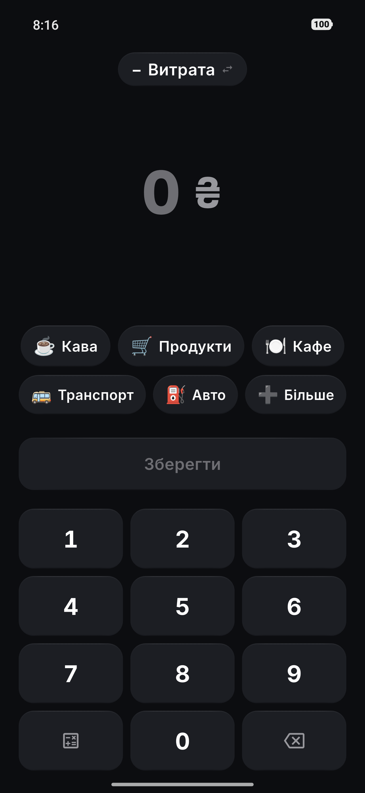
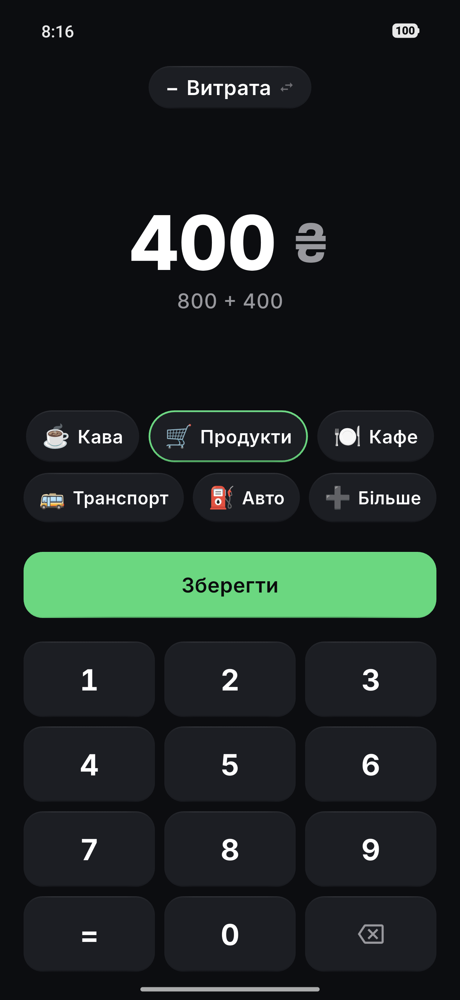
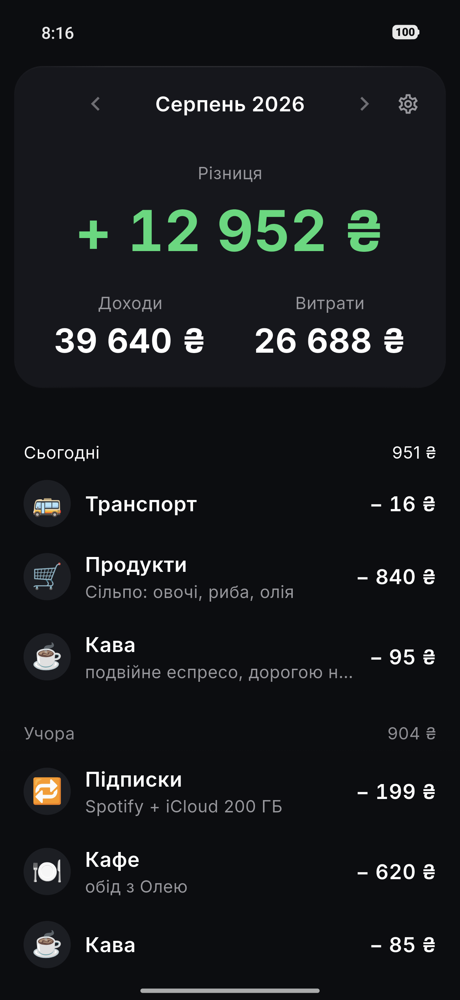
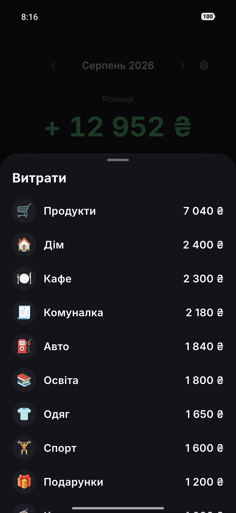

<h1 align="center">QVAS</h1>

<p align="center"><b>Витрата записана раніше, ніж ти сховав гаманець.</b><br>
Офлайн за побудовою: без акаунта, без сервера, без аналітики. З телефона нічого не виходить.</p>

<p align="center">
  <a href="https://github.com/yevhenmyronov/qvas/actions/workflows/ci.yml"></a>
  
  
  
</p>

<p align="center"><a href="README.md">🇬🇧 Read in English</a></p>

<p align="center">
  
  
  
  
</p>

<p align="center"><sub><a href="marketing/screenshots/">Усі десять знімків</a> · зняті з демо-збірки із засіяними даними</sub></p>

---

## Що це

Двоекранний трекер витрат для Android, побудований навколо одного вимірюваного
показника: **менше двох секунд від тапу по іконці до збереженої транзакції.**

Це число і є всім дизайном. Цифровий пад відкритий одразу при запуску — немає
кнопки «додати», яку треба натиснути перед тим, як почати. П'ять категорій, якими
користуєшся найчастіше, стоять під великим пальцем. Сума, категорія, зберегти.
Більше на цьому шляху немає нічого.

Кожне інше рішення в продукті звірялося з питанням: чи додає ця фіча клік на
цьому шляху. Більшість додає — тому більшості тут немає.

## Що вміє

- **Два екрани.** Ввід і історія. Третього не буде.
- **Калькулятор просто на паді.** `800 + 400` під сумою, бо «два оцих і одне оте»
  трапляється біля каси, а не в голові. Чотири дії, зліва направо, без пріоритету
  операцій — так, як рахує кишеньковий калькулятор і як очікує людина.
- **Доходи зі свідомою межею.** Доходи існують рівно для одного: показати різницю
  за поточний календарний місяць. Немає накопичувального балансу, гаманців і
  перенесення залишку.
- **Розумні категорії.** Закріплені бульбашки переставляються за тим, чим ти
  справді користуєшся, — але ніколи за часом доби, бо кнопка, що переїжджає під
  пальцем кілька разів на день, вбиває м'язову пам'ять, на якій тримаються ті
  самі дві секунди.
- **Куди пішли гроші.** Список категорій за сумою, а не кільцева діаграма. Список
  читається швидше й не потребує легенди.
- **Нотатки до 60 символів.** Досить для «подарунок, Аня» і замало, щоб застосунок
  став щоденником.
- **Резервна копія і експорт у CSV** — файлами, через системну шторку «Поділитися».
- **Українська та англійська**, причому валюта обирається окремо від мови.
- **Скасування видалення** — записи видаляються м'яко, тож промах пальцем оборотний.

## Чого тут свідомо немає

Цей список і є продуктом. Кожен рядок окремо виглядає розумно — саме тому він
записаний.

| Немає | Чому |
|---|---|
| Синхронізація з банками | Потребує мережі, серверів і акаунтів. Знищує все позиціонування одним рухом |
| Хмарна синхронізація між пристроями | Те саме. Замість неї — ручний експорт та імпорт |
| Реєстрація, акаунт, вхід | Немає жодного сценарію, де це щось дає користувачу |
| Реклама | — |
| Аналітика, телеметрія, крашлоги | Ми свідомо погоджуємось бути сліпими |
| Будь-яка залежність, що ходить у мережу | Кожна бібліотека перевіряється на мережеву активність **до** того, як потрапить у `pubspec.yaml` |
| Діаграми | Питання звучить «куди пішли гроші», і відсортований список відповідає на нього швидше |
| Кілька гаманців чи рахунків | Пряма дорога до бухгалтерії |
| Конвертація валют | Ми офлайн, курсів узяти нізвідки |
| Ландшафтна орієнтація | Подвоює роботу над версткою заради сценарію, якого не існує |
| Світла тема | Подвоює кількість станів для малювання й тестування |

Реліз-маніфест оголошує рівно один дозвіл — `VIBRATE`, для хаптики. Дозволу
`INTERNET` немає, як немає й жодної мережевої залежності: застосунок не може
нічого нікуди надіслати, навіть якби хтось дописав код, який намагається. (Свої
debug- і profile-маніфести Flutter таки постачає з `INTERNET` — це інструменти
розробки говорять із пристроєм, у релізній збірці цього немає.)

## Архітектура

Свідомо пласка. Для двоекранного застосунку три шари абстракцій коштували б
більше читабельності, ніж повертають.

```
lib/
  db/            Drift: таблиці, DAO, міграції
  models/        доменні моделі, енуми, розширення
  repositories/  транзакції, категорії, налаштування
  providers/     Riverpod-провайдери
  services/      резервна копія, CSV, шеринг
  ui/
    input/       екран 1: пад, калькулятор, бульбашки категорій
    history/     екран 2: стрічка, підсумки місяця, розбивка
    sheets/      усі нижні шторки
    settings/    налаштування
    onboarding/  перший запуск
    common/      спільні віджети
  theme/         токени дизайн-системи як Dart-константи
  l10n/          ARB-файли
```

Єдине правило: **UI ніколи не звертається до Drift напряму**, тільки через
репозиторій. Ця одна абстракція існує рівно для того, щоб майбутній нативний
віджет на домашньому екрані читав ті самі дані, не вплітаючись у код екранів.

Три рішення, які варто назвати окремо, бо саме їх було б болісно міняти згодом:

- **SQLite через Drift, а не Hive чи Isar.** Не заради швидкості — на десяти
  записах на день будь-яка база миттєва. Причини інші: підтримка (обидва NoSQL-варіанти
  втратили мейнтейнерів), агрегації (`SUM` і `GROUP BY` виконує сама база, замість
  вантажити все в пам'ять) і запланований нативний віджет, якому доведеться читати
  дані з Kotlin.
- **Гроші — `int` у мінорних одиницях.** `85.00` зберігається як `8500`. У двійковій
  арифметиці `0.1 + 0.2 != 0.3`, і користувач, який помітить, що сума рядків не
  сходиться з підсумком, матиме цілковиту рацію не довіряти застосунку.
- **Дата зберігається двічі.** `createdAtUtc` упорядковує записи всередині дня;
  `localDateKey` (`2026-08-13`, обчислений у момент запису) вирішує, якому дню
  запис належить. Одне поле не здатне робити обидві роботи, коли міняється
  часовий пояс.

**Стек:** Flutter 3.47 · Dart 3.13 · Riverpod · Drift/SQLite · `minSdk 24` · `targetSdk 36`

## Збірка

```bash
git clone https://github.com/yevhenmyronov/qvas.git
cd qvas
flutter pub get
flutter run
```

Релізна збірка потребує ключа підпису. Скопіюй `android/key.properties.example`
у `android/key.properties` і заповни. Без нього збірка не падає, а відкочується
на debug-ключ, тож це працює одразу:

```bash
flutter build apk --release --target-platform android-arm64
```

Для орієнтиру, на пристрої розробки: холодний старт **317–364 мс** при бюджеті
800, APK arm64 — **21 МБ**.

## Тести

```bash
flutter test
```

140 тестів у 23 файлах: арифметика грошей і округлення, поведінка ключа дати при
зміні часового поясу, семантика калькулятора, порядок категорій, повний цикл
резервної копії, екранування CSV і golden-тести, що фіксують сім станів екранів.

Два файли — не юніт-тести, а лінтери, і саме їх варто вкрасти собі.
`lint_tokens_test.dart` проходить по `lib/` і валить збірку, якщо
шістнадцятковий колір трапився поза `theme/tokens.dart`, якщо радіус написаний
числом замість `AppRadius`, якщо шторку відкрито повз єдиний спільний хелпер або
якщо другий віджет малює власне коло під емодзі. `lint_durations_test.dart`
вимагає, щоб кожна тривалість анімації йшла через `AppDurations.of(context, …)`,
який повертає нуль при увімкненому системному «Прибрати анімації», — узяти токен
напряму означає тихо зламати доступність. Кожне правило з'явилося після того, як
відповідний дубль уже стався: свого часу в коді жило сім реалізацій одного рядка.

## Приватність

Тут немає політики приватності, яку варто уважно читати, бо немає збору даних,
який треба було б описувати. Жодна залежність у `pubspec.yaml` не відкриває
сокет, релізна збірка не має мережевого дозволу, а база — це звичайний файл
SQLite у приватному сховищі застосунку. Резервна копія залишає пристрій лише
тоді, коли ти сам поділишся файлом, і рівно туди, куди вкажеш.

## Стан

Версія 0.3.2. Функціонально завершений для щоденного вжитку і використовується
щодня — автор веде в ньому власні витрати місяцями. Опублікований як код, а не як
продукт: це завершена робота, а не бізнес.

## Ліцензія

MIT — див. [LICENSE](LICENSE). Вбудовані шрифти й залежності мають власні
ліцензії, перелічені у [THIRD_PARTY.md](THIRD_PARTY.md).
